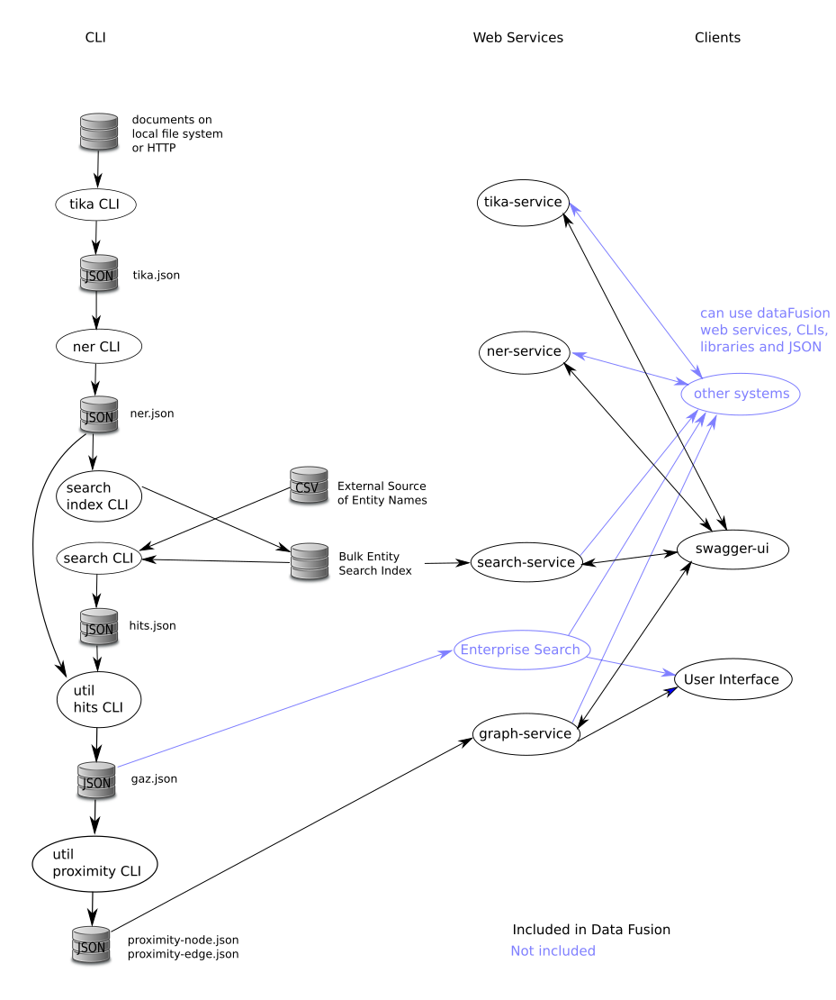

# dataFusion

## Introduction

The purpose is to extract useful information by fusing unstructured data with structured data.

This project:

1. extracts text and meta-data and performs language detection from a wide variety of unstructured document formats (PDF, Word, Excel etc.) using [Apache Tika](https://tika.apache.org/). Processing includes embedded documents, which in the case of images involves using [Tesseract](https://github.com/tesseract-ocr/tesseract/wiki) [OCR](https://en.wikipedia.org/wiki/Optical_character_recognition) to obtain the text.
2. performs [Named Entity Recognition](https://en.wikipedia.org/wiki/Named-entity_recognition) (NER);
4. provides batch search for known entities in documents, reporting locations of each match;
6. builds a network of entities that appear close together in documents and so are likely related in some way; 
7. provides web services to the above and multi-threaded command line interfaces (two alternatives to access the same functionality).

The following diagram depicts the processing steps and data flow. 

Please see [JSON Data Formats](dataFusion-common#json-data-formats) for details of the data at each step.

## Project Structure
The top level directory provides the [sbt](http://www.scala-sbt.org/) build for the [Scala](http://scala-lang.org/) sub-projects in each of the child directories:
- `dataFusion-$name` for libraries; and
- `dataFusion-$name-service` for [RESTful](https://en.wikipedia.org/wiki/Representational_state_transfer) web services.

The library projects dataFusion-{tika,ner,search} all provide a multi-threaded command line interface (CLI) for efficient bulk processing without the need for web services and clients.

## Scalability

Scalability options, ordered by least change first, are:

1. Run CLI's on a single machine with more CPUs.
2. Split the data, run CLI's on multiple machines, join the results. This is Map-Reduce without using Hadoop. [GNU Parallel](https://www.gnu.org/software/parallel/) should make this easy.
3. Run web services on multiple machines with a load balancer in front of them (most web servers can perform this function). The load balancer is transparent, it looks to a client just like the web service. Client software (needs to be written) makes requests to the load balancer which distributes the requests to the machines running the web services.
4. Hadoop with or without Spark. To benefit from the cluster it is crucial that the heavy processing: Tika, ImageMagik (image preprocessing done before Tesseract), Tesseract and NER, runs on the processing nodes. This would require installation on all the processing nodes of ImageMagik, Tesseract and the non-Java components of the MITIE NER implementation (the models which are data files and the C++ code which resides in a shared library, a .so file). Options 2 & 3 above have this same requirement, however this may be more acceptable on single purpose VM's than it is on a general purpose cluster.

## Build

There are a large number of non-JVM system dependencies:

- dataFusion-ner uses MITIE (C++ code) with some runtime dependencies and many build time dependencies
- Apache Tika has runtime dependencies on ImageMagick and Tesseract OCR
- dataFusion-tika has an additional dependency on Libreoffice (if Tika has a particular error with an Excel spreadsheet it is converted to Open Document Format and retried).

The `docker` directory provides Dockerfiles for Ubuntu and Centos configured with all required dependencies.

Run in the dataFusion top level directory:

    OS=ubuntu                          # or OS=centos
    cd docker
    docker build --file Dockerfile-$OS --tag dfus-$OS .  # create OS image
    cd ..
    
    # create OS container with dataFusion top level directory mounted at /dfus and run the container
    docker run --name dfus-$OS -it --mount type=bind,source=$PWD,destination=/dfus dfus-$OS
    
    # now, in the container ...
    cd /dfus
    ./build.sh                         # see script for alternatives
    exit                               # exit the container

Alternatively you can manually install the dependencies on your physical host using the Dockerfiles as a guide, then run `build.sh` natively (on your physical host).

## Run

The Scala programs are packaged by the build as a [onejar](https://github.com/sbt/sbt-onejar). This is a jar file containing ideally all dependencies and run simply with: `java -jar {filename.jar}`.

However, as noted above, dataFusion-tika and dataFusion-ner have additional runtime dependencies.
You can either:

- manually install the dependencies on your physical host using the Dockerfiles as a guide; or
- continue to use the automatically configured docker containers from the build with `docker start -i dfus-$OS`.

Run in the dataFusion top level directory (`/dfus` if using a docker container):

    OS=ubuntu                          # or OS=centos
    source sh/setenv.$OS               # set the environment

    # get help for the search CLI, running the one-jar from where the build creates it 
    java -jar dataFusion-search/target/scala-2.12/datafusion-search_2.12-0.1-SNAPSHOT-one-jar.jar --help

    # or use the dfus script for convenience
    dfus -h                            # get help for the sh/dfus script
    dfus tika --help                   # get help for the tika CLI
    dfus ner --help                    # get help for the ner CLI
    dfus search --help                 # get help for search CLI (same as java -jar example above)

    # run tika on all files under /collections; -m 7 to set 7GB Java heap; default output to tika.json
    find /collections -type f | dfus -m 7 tika
    
    # run tika only on the files listed in demoFiles.txt
    dfus -m 7 tika --output tika-demo.json < demoFiles.txt
    
    # run NER; default output to ner.json
    dfus -m 7 ner < tika.json
    
    # create bulk search index (location set in sh/setenv)
    dfus search --index < ner.json
    
    # bulk search for entities in entities.csv; default output to hits.json
    dfus search --searchCsv < entities.csv
    
    # merge search results (hits.json) into ner results (ner.json)
    # also create Ner entries from names in email headers; default output to gaz.json
    dfus util --hits hits.json --email < ner.json
    
    # proximity network building; default output to proximity-node.json and proximity-edge.json
    dfus util --proximity < gaz.json
    
    # start graph-service using data from proximity-node.json and proximity-edge.json; default port 8089
    dfus graph-service &

### Configuration

These projects have configuration in `src/main/resources/application.conf`, which uses `${?ENV_VAR}` syntax to define environment variables that may be set to override default values set in the file. For example dataFusion-ner's [application.conf](dataFusion-ner/src/main/resources/application.conf) sets the default location for MITIE's English NER model to `MITIE-models/english/ner_model.dat` (relative to whatever directory the program is run from) and allows this to be overridden by setting an environment variable `NER_MITIE_ENGLISH_MODEL`.

Note that configuation is the union of all the `application.conf`'s on the class path. The project's own `application.conf` takes precedence, but the `application.conf`'s of dependent projects
are also used. So the web service projects (e.g. datFusion-ner-service) also use their base project's configuration (e.g. dataFusion-ner).

### Recommendations

- override all relative paths with environment variables specifying absolute paths; and
- set configuration environment variables for all dataFusion programs in `sh/setenv.$OS` and source this file prior to running any of the programs
- use the convenience script `sh/dfus` for shorter command lines as shown above.
     
## Swagger Support

The `dataFusion-*-service` web services use [Swagger](https://swagger.io/) to both
document their APIs and provide a user interface to call them (for use by developers rather than end users).
Each web service exposes an endpoint `http://host:port/api-docs/swagger.json` which provides the Swagger description of the service.

### Install swagger-ui

To install [swagger-ui](https://swagger.io/swagger-ui/) download it and copy the `dist` dir to `swagger-ui` on a web server.

### Use swagger-ui

- open the swagger-ui URL in a web browser, e.g. something like: `http://webServer/swagger-ui/`
- paste in the URL of web service's Swagger description, e.g. something like: `http://host:port/api-docs/swagger.json`

## Develop With Eclipse

The command:

    sbt eclipse

uses the [sbteclipse](https://github.com/typesafehub/sbteclipse/wiki/Using-sbteclipse) plugin to create the .project and .classpath files required by Eclipse (with source attachments for dependencies).

### Update Documentation of Third-party Dependencies

If libraries are changed, update the `3rd-party-licenses.md` for each sub-project.
After `sbt dumpLicenseReport` run:

    for i in */target/license-reports/*.md; do cp $i ${i%%/*}/3rd-party-licenses.md; done

## Software License

This software is released under the [GPLv3](LICENSE.txt). For alternative licensing arrangements please contact Warren.Bradey@data61.csiro.au. Each of the Scala sub-projects lists its dependencies and their licenses in 3rd-party-licenses.md.

